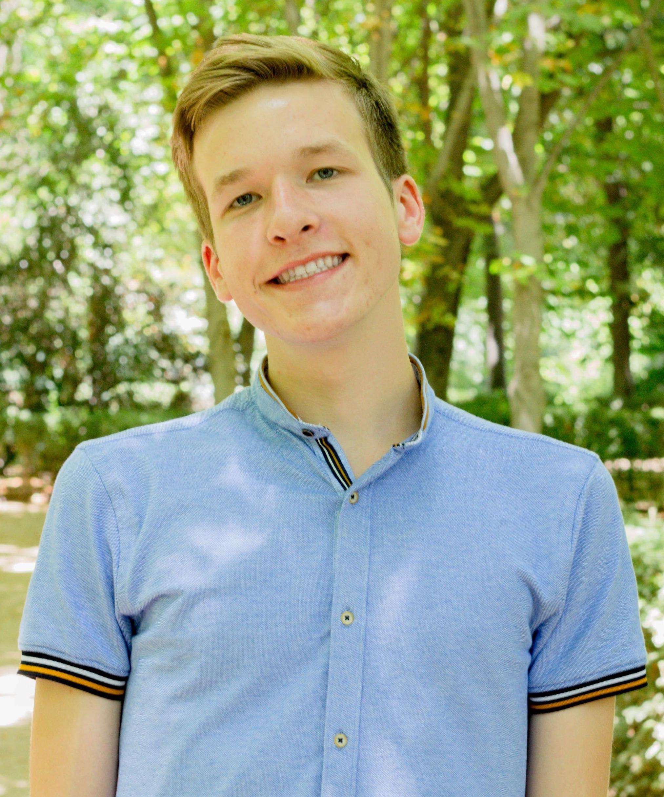

## Welcome to Henry's Google Summer of Code Project Blog

### About:



My name is Henry Smith, and I am a rising junior at Yale College majoring in Statistics & Data Science with an interest in U.S. government, specifically political communication between elected officials and their constituencies. For my Google Summer of Code project in collaboration with Red Hen Lab, I will be working with mentors [Jungseock Joo](http://home.jsjoo.com/) at the University of California, Los Angeles Deparment of Communication and [Dr. Kunwoo Park](http://kunwpark.kr/), a postdoctoral researcher at the University of California, Los Angeles Deparment of Communication. The project will focus on understanding how Democratic politicians communicate with racial, sexual, and gender minority voters through social media visual imagery. By the generosity of Dr. Joo and his colleagues, images will be sourced through a dataset compiled from politician Facebook accounts during the 2018 U.S. midterm election cycle. 

The complete proposal can be found in my [Github repository for the project](https://github.com/smithhenryd/GSoC_2020_MinorityMessagesAndDemocrats-).

#### Contact Information:
I am always excited to receive feedback on my work or meet new people, so feel free to reach out to me using any of the following platforms.

- Email: henry.smith@yale.edu
- Facebook: [Henry Smith](https://www.facebook.com/profile.php?id=100023679815464)
- Github: [smithhenryd](https://github.com/smithhenryd) 

### Blog:

Throughout the summer, I will document progress on my Google Summer of Code project through weekly blog posts. The posts are ordered with the most recent posts presented first:

#### VII. Week 4 (Final Week Prior to First Evaluation):

As the first evaluation period approaches, I have worked to compile preliminary results from my annotation of the simple random sample. For the sake of confidentiality of the lab's Facebook images dataset (including metdata and annotation), no code is posted. Nonetheless, key findings are summarized as follows:

**Facial recognition assesment**:

In order to assess the accuracy of the lab's resnet-based facial recognition code, I first compare the results of whether a politician was recognized in each image via manual annotation to the outcomes when the code was run on the sample by Dr. Park. Whereas manual annotation marked 47.61% of images in the sample as picturing the Democratic politician, the facial recognition code did so for only 25.30% of images. However, despite this discrepancy, manual annotation and the facial recognition agreed on 75.85% of classifications (present/not present). A majority of disagreements between the two methods were false-negatives by the face detection (96.39%), while only a small percentage were false-positives (3.61%). Upon observing these images, it is clear that a majority of the false-positives were due to human error in manual annotation (marking the politician as 'not present' when they were, in fact, present in the image). A number of  in the false-negative images are as follows

- Side profile of face
- Face is obscured (ex. only back/top of head visible)
- Politician in background of image (as opposed to foreground)
- Depiction of the politician's face is too small


|                     |    **Response Variable**   | 'black_appeal' |  'hispanic_appeal'| 'asian_appeal'| 'LGBTQ+\_appeal' |
| --------------------| ---------------------------| ---------------| ------------------| --------------| -----------------|
|  **Predictor**      | 843                        | 9.3713%        | 2.8470%           | 2.2539%       | 0.9490%          |
| Text imgs included  | 1027                       | 7.9844%        | 2.8238%           | 2.0448%       | 1.1685%          |


#### VI. Week 3:

##### Manual Annotations:

The primary focus of my work this week was completing manual annotations of the simple random sample of 3,264 Facebook images. Annotation was completed according to the [scheme](https://github.com/smithhenryd/GSoC_2020_MinorityMessagesAndDemocrats-/blob/master/imgs_data/Images%20Annotation%20Scheme_Final.pdf) finalized during week 2. Along with my annotations, the lab has two additional individuals who will be working to complete annotations of the sample for the following week. 

##### Facial Recognition: 

Dr. Joo's lab has previously written code using a residual neural network (resnet) to recognize the faces U.S. political candidates. In addition to recording whether a politician is/is not physically present in a given image during annotation, we would like to automate this process using the lab's existing facial recognition code. With the help of my mentor, Dr. Kunwoo Park, we ran this code on the sample of Facebook images and have recorded the results in a csv file. Upon completion of the manual annotation task, we will assess the accuracy of the facial recognition code by comparing it to the manual results. 

*\*for the sake of confidentiality, the facial recognition code is not included*

Note that current progress on the project is dependent on the completion of the manual annotation task. We are hoping that all three annotations will be completed by the end of this coming week.

#### V. Week 2:

Through the generous assistance of Dr. Kunwoo Park, we were able to clean up the data, so to subset the entire 2018 Facebook images dataset to only include those images shared by Democratic politicians along with their corresponding captions. Dr. Park also collected a simple random sample of 3,264 of these images to use for our first annotation, which amounts to up to seven images per politician. Note that this is a simple random sample as opposed to a sample collected using a classifier as discussed in the previous week's post. Our intention is to collect these preliminary annotations and then train a classifier to select Facebook images that may be positively annotated with each of the four minority appeal variables at a greater rate.

Additionally, we discussed the issue of potential bias induced by a candidate's race or ethnicity when they are physically present in a shared image. Perhaps annotators, not knowing which individual in the image is the politician, would falsely believe that a minority politician is appealing to the minority group to which they belong (ex. the presence of a Black politician would lead annotators to believe that the politician is appealing to Black voters). In order to mitigate this source of bias, I compiled a dataset consisting of images of each of the politicians included in the random sample. For each Facebook image and caption presented to the annotator, they will also be shown an image of the politician. As the annotator knows the politician's appearance, they should be able to pick out the politician's presence in the Facebook images and, accordingly, should not mistake this presence for minority appeal. 

Another source of bias we discussed is the annotator's potential recognition of the candidate. If the annotator were to recognize a prominent politician, for instance, by either the image file names or by their appearance, would this affect their annotation of the four minority group-specific appeal variables? We concluded that, provided these minority appeal variables are not apparently related to the positive/negative view of the politician, the effect of this potential bias would be small. 

In order to prepare for image annotation, I refined my original annotation scheme in the following ways:

- Include a question that asks the annotator whether the politician is included in the model; this will (1) be important to incorporate into the machine learning model and (2) allow the annotator to consciously consider a candidate's role in the image prior to making any annotations on the minority group appeal variables

- Provide the annotator with a definition of 'appeal' as well as context for how 'appeal' pertains to politicians' attempts to gain support among voters 

- Break down each of the four minority group-specific appeal variables, 'Black_appeal', 'Hispanic_appeal', 'Asian_appeal', and 'LGBTQ+\_appeal', into separate questions

The finalized scheme (which will be used for annotation) can be found [here](https://github.com/smithhenryd/GSoC_2020_MinorityMessagesAndDemocrats-/blob/master/imgs_data/Images%20Annotation%20Scheme_Final.pdf).

Moreover, I have created a [spreadsheet](https://docs.google.com/spreadsheets/d/12cUOqOxmk4Q0TC683jrqbtb5uCG4-cNBwrJTKgIh-NA/edit?usp=sharing) by which to record annotations, which can [also be viewed in Github as a csv file](https://github.com/smithhenryd/GSoC_2020_MinorityMessagesAndDemocrats-/blob/master/imgs_data/Facebook%20Image%20Annotation%20-%20Sheet1.csv). Hopefully, this image annotation will be finished by the end of the following week. As of this weekend, Dr. Joo is working to recruit two UCLA students to annotate the sample. When these students have been selected, Dr. Park and I will meet with them to explain the annotation scheme as well as how the image files are organized. 

For storage purposes, I am maintaining the sample data on my Google Drive and using [Google Colaboratory](https://colab.research.google.com/notebooks/intro.ipynb) to run scripts. Besides the numerous data science-related packages that are preinstalled in the cloud service, Colab also provides free use of a GPU. The following script, which can also be viewed [directly in Colab](https://colab.research.google.com/drive/1bJRmhuphQsTgN5S7_q-CJErGxPtsRvdt?usp=sharing), mounts to my Google Drive account so to organize the sample data. Thereafter, the script creates a new directory for each Facebook image in the sample and moves the Facebook image, caption (as a txt file), and politician image into this directory. Hopefully, this will make the annotation process much easier as opposed to looking through the entire dataset for each Facebook image. 

```ruby
import pandas as pd
from google.colab import drive
import os
import shutil

# mount to Google Drive account 
drive.mount('/content/drive', force_remount=True)
os.chdir("/content/drive/My Drive/GSOC2020/Training Model")

# read in metadata and keep the file name, caption, politician name, and office 
img_files = pd.read_csv("annotation_sample_random_metadata.csv")
img_files = img_files[['filename','caption', 'name', 'Election']]
num_rows = img_files.shape[0]

# make directory in which to store annotation folders
os.mkdir("annotation_folders")

for i in range(num_rows):
  # create a new folder for image annotation
  os.chdir("/content/drive/My Drive/GSOC2020/Training Model/annotation_folders")
  folder_num = i + 1
  os.mkdir(f"{folder_num}")
  os.chdir(f"/content/drive/My Drive/GSOC2020/Training Model/annotation_folders/{folder_num}")
  
  # move Facebook image into this folder
  img_Facebook = img_files.iloc[i]['filename']
  shutil.move(f"/content/drive/My Drive/GSOC2020/Training Model/annotation_sample_random/{img_Facebook}", f"/content/drive/My Drive/GSOC2020/Training Model/annotation_folders/{folder_num}")
  
  # write Facebook caption as a txt file in this folder
  caption_txt = open(f"{img_Facebook}.txt", mode="w")
  caption = img_files.iloc[i]['caption']
  caption_txt.write(f"{caption}")
  caption_txt.close
  
  # move a copy of the corresponding polician image into this folder
  if img_files.iloc[i]['Election'] == "House":
    chamber = "houses"
  elif img_files.iloc[i]['Election'] == "Governor":
    chamber = "govornor"
  elif img_files.iloc[i]['Election'] == "Senate":
    chamber = "senates"
  politician_name = img_files.iloc[i]['name'].rstrip()
  try:
    politician_img = f"facebook_dataset_{chamber}_{politician_name}.jpg"
    shutil.copy(f"/content/drive/My Drive/GSOC2020/Training Model/politician/{politician_img}",f"/content/drive/My Drive/GSOC2020/Training Model/politician/{politician_img}*annotate")
    shutil.move(f"/content/drive/My Drive/GSOC2020/Training Model/politician/{politician_img}*annotate", f"/content/drive/My Drive/GSOC2020/Training Model/annotation_folders/{folder_num}")
  except FileNotFoundError:
    politician_img = f"facebook_dataset_{chamber}_{politician_name}.jpeg"
    shutil.copy(f"/content/drive/My Drive/GSOC2020/Training Model/politician/{politician_img}",f"/content/drive/My Drive/GSOC2020/Training Model/politician/{politician_img}*annotate")
    shutil.move(f"/content/drive/My Drive/GSOC2020/Training Model/politician/{politician_img}*annotate", f"/content/drive/My Drive/GSOC2020/Training Model/annotation_folders/{folder_num}")
```

#### IV. Coding Period Week 1:

##### Research Overview: 
I spent the first half of this week conducting [background research](https://github.com/smithhenryd/GSoC_2020_MinorityMessagesAndDemocrats-/blob/master/background/Research%20Overview_%20Politician%20Appeal%20to%20Minority%20Candidates_updated.pdf) related to how U.S. politicians have used racial appeals in the past and how these appeals differ by political party. This task required that I sift through my university's library resources, and I have compiled information from the most relevant articles and books in a document located in the project's Github repository. This summary is by no means comprehensive and is only related to the political side to the project, but it provides an important overview of race theory, a topic in which I have little prior knowledge. 

A few relevant discussions to consider are as follows:

- At first, one may think that minority candidates leverage connections within their respective racial and ethnic communities and thus display more visual appeals to these groups. McIllwain and Caliendo, 2011, however, suggests that, under certain conditions, the opposite may be true: minority candidates with predominantly white consituencies may use **counter-stereotype references**. The candidate, seeking to counter the racist stereotypes held by white voters, may distance themselves from their own racial or ethnic group. 

- An analysis of political advertisements by McIllwain and Caliendo, 2011 suggested that racial appeals by minority candidates focus primarily on the candidates image as opposed to concrete policy. 

- The context of images may be important in determining their appeal to the measured racial & ethnic, gender, and sexual minority groups. Valentino, Hutchings, and White, 2002, concluded that the mere presence of Black individuals in advertisements is ineffictive at priming _negative_ racial prejudices in voters, while contextualizing these ads with narratives was most effective at doing so. Whereas the appeals we are looking at will most likely be positive as opposed to negative, including the captions of shared images may nonetheless provide an important narrative to the voter. 

- Mendelberg's 2001 work _The Race Card: Campaign Strategy, Implicit Messages, and the Norm of Equality_ is an essential text in understanding racial appeals by U.S. politicians. The idea of a norm, a social construct guiding and constraining individual behavior, is especially relevant to our research. Despite the importance of this work, Mendelberg's 2001 analysis may not be indicative of today's political environment. He discusses the norm of racial equality established in the 1960's under which both major political parties (Democrat and Republican) had to function. Mendelberg predicts that, under this norm, Democrats would remain silent on race so not to isolate themselves further from moderate white voters.

- Arora's 2019 _Which race card? understanding racial appeals in U.S. politics_, published largely as a modern update to theories of Mendelberg, establishes the _theory of differential norms_. This theory claims that, under increasing politicial division, norms are determined by party affiliation, with Democrats functioning under the norm of racial equality and Republicans under racial _inequality_. Her research shows that, contradictory to Mendelberg's claim, Democrats who utilize explicit pro-Black, pro-Latino, and pro-Muslim appeals perform better in hypothetical primary elections than those who don't use these messages. The theory of differential norms is promising to our research as it suggests that Democratic candidates will actively and explicitly seek to appeal to racial minority groups. 

- There are a number of political issues implictly linked to race, including states' rights, the criminal justice system, etc., that Mendelberg mentions in his work. Although McIllwain and Caliendo, 2001 offered that most racial appeals are candidate-based, we may seem some images that intend to appeal to minority voters through these issues.  

##### Image Preparation for Annotation:
The next step is obtaining a representative sample of images from the 2018 Facebook dataset to be annotated. Upon meeting with Dr. Joo, we have determined the specifications for this sample as follows:
 
- Images from Democratic candidates
- Include text-based images
- Include image captions
- ~4,000 images to be annotated

I also include a preliminary draft of the schema used for image annotation:

This image along with its caption were shared to the social media platform Facebook by an American politician during the 2018 United States election cycle. By doing so, do you believe that they, the politician, had the intention of appealing to (alternative wording: attracting the support of) [Black/Hispanic/Asian/LGBTQ+] voters? 


Yes (= 1)

No (= 0)


Note: Be sure to clarify that LGBTQ+ means: lesbian, gay, bisexual, transgender, questioning, and other sexual and gender minority individuals.

In preparing this sample, I will be working under the guidance of Dr. Kunwoo Park, who has collaborated with Dr. Joo in the past and has expertise in image classification. Dr. Park will be helping to clean the raw dataset of all images so to include images shared only by Democratic candidates. Additionally, I will be writing up the complete coding scheme for manual annotation (a rough idea of which is included above). 

It is important to mention that simply taking random samples from the prepared dataset of all Democratic images will _not_ be sufficient for collecting manual annotations. This is because, as illustrated by the results from the preliminary annotation, the proportion of positive annotations for each of the four minority variables is relatively small. And to train a prediction model that can be applied to a test set of the data, we would like to have hundreds, ideally near one thousand, positively annotated images for each of 'Black_appeal', 'Hispanic_appeal', 'Asian_appeal', and 'LGBTQ+\_appeal'. Therefore, we will use existing race and ethnicity recognition as well as symbol detection (ex. rainbow flag, Human Rights Campaign logo) models to pick out images that may have higher than average positive annotation rates for these respective variables when presented to annotators. The preparation of these images for annotation (creating scheme, cleaning data, and applying existing models) will be my primary focus for the upcoming week. 


#### III. Preliminary Image Annotation 05-29-20:

Prior to annotating the 2018 Facebook images dataset, we must first determine minority group-specific variables of interest. As cited in the project proposal, a 2017 report by the Pew Research Center estimated that Black voters constituted 19% of the Democratic party, Hispanic voters, 12%, and Asian voters, in combination with other racial and ethnic minority voters, 10% [2]. For the sake of our analysis, in order to obtain a sufficiently large sample of images pertaining to each group, we will measure the appeal of Democratic politicians to **Black, Hispanic, and Asian voters**. Additionally, as our research also seeks to examine political appeal to sexual and gender minority voters, we include a variable **'LGBTQ+\_appeal'**. An exit poll by NBC conducted during the 2018 U.S. midterm election estimated that LGBT voters consititued 6% of the electorate, and 82% of these voters supported the Democratic candidate [1]. Similarly, while LGBTQ+ could be separated into various sexual and gender minority classifications, each subset would likely only pertain to very few images.

As it would be difficult to create a continuous scale on which to measure a politician's intended appeal to a given minority group that is consistent across annotators (what one annotator considers moderate appeal may be different from another), we use a nominal classification. The value = 1 is assigned to images in which the politician had the _intention of_ appealing to the respective minority group, and = 0 is assigned to those in which this intention is not present. 

So to gain a better understanding of the proportion of images to which each minority group-specific variable pertains (i.e.  images such that a given variable = 1), I annotate a random sample of 2,000 images from the Facebook images dataset. Moreover, two seperate analyses are performed: the first in which text-based images are excluded from annotation and the second in which these images are included. 


| Variable            | Total Dem images annotated | 'black_appeal' |  'hispanic_appeal'| 'asian_appeal'| 'LGBTQ+\_appeal' |
| --------------------| ---------------------------| ---------------| ------------------| --------------| -----------------|
| Text imgs excluded  | 843                        | 9.3713%        | 2.8470%           | 2.2539%       | 0.9490%          |
| Text imgs included  | 1027                       | 7.9844%        | 2.8238%           | 2.0448%       | 1.1685%          |


Of course, we are limited in terms of statistical analyses, as the two samples are by no means independent of one another (there are only 184 additional images in the 'text imgs included' set that are not also in the 'text imgs excluded'). However, the data seems to suggests that non-textual more so than textual images are used by Democratic politicians to appeal to minority voters, with the exception of the LGBTQ+ community. The visual appeal to LGBTQ+ voters is primarily symbol-based (rainbow pride flag/banner, Human Rights Campaign logo, etc.) as opposed to the physical presence of LGBTQ+ individuals, which may explain why the difference is present particularly among this group.

As the GSOC coding period comes to an official start, I will next work to formulate questions by which a larger subset of the images will be annotated. Because the proportion of images that intend to appeal to each of the four minority groups is relatively small (as we see from the above results), we may need to build a preliminary prediction model by which to pick out images thought to appeal to each of the four groups. This would allow us to have a larger positive annotation rate than if images were just randomly sampled from the Facebook images dataset. 

[1] Fitzsimons, T. (2018, November 08). Record LGBT support for Democrats in midterms, NBC News Exit Poll shows. NBC News. Retrieved from https://www.nbcnews.com/feature/nbc-out/record-lgbt-support-democrats-midterms-nbc-news-exit-poll-shows-n934211.

[2] “Wide Gender Gap, Growing Educational Divide in Voters’ Party Identification.” Pew Research Center, Washington, D.C. (2018, March 20) https://www.people-press.org/2018/03/20/wide-gender-gap-growing-educational-divide-in-voters-party-identification/. 

#### II. Community Bonding Period 05-18-20:

The Google Summer of Code has officially started, and it is off to a great start! In this blog post, I will summarize progress that I have already made as well as actionables that I see as achievable in the near future.

- **Software setup**: With the help of the other students, I have successfully connected to the Case Western Reserve University HPC and have established a home directory in Gallina, Red Hen Lab's server. However, I am still in the process of creating a Singularity container in which I will run the code for my project, as is required by the collaborative. I have not had any prior experience with Singularity nor am I  a master of the terminal window, but I am trying my best. A more complete guide to connecting to the Case HPC is included in blog entry I.

- **2018 U.S. Midterm Elections Images Dataset**: Unlike a majority of the other Red Hens participating in the GSoC, I will not be using the UCLA television news dataset but rather a novel dataset collected by Dr. Jungseock Joo and his colleagues consisting of Facebook images published by politicians during the 2018 U.S. election cycle. As outlined by my proposal, I will use this data to better understand how Democratic politicians communicate with racial, sexual, and gender minority consistuents. 


_Fig. 1: What does it mean for an political image to appeal to a minority group? Clearly the right image (Darren Soto, FL, U.S. House of Representatives) appeals to Hispanic voters much more so than the left (Bill Nelson, FL, Governor candidate), but how is this quantified?_

  - The first challenge, showcased by the two sample images from the dataset included above, is determining **how to measure an image's appeal to a given minority group**. My goal is to observe and annotate a random sample of 2,000 images from the dataset to gain a better answer to this question. Potential explanations are included as follows:
    - [x] Race & ethnicity of individuals 
     - How do we distinguish between the race & ethnicity of the _politician_ versus potential _other individuals_ included in the images?
    - [x] Symbols (ex. flags)
    - [x] Perhaps there are certain cultural elements that cannot be explained or captured so explicitly
     - How do we account for these subtleties in the set of variables measured for the polticial images?

Ultimately, the goal of this discussion is to determine **how to construct a set of variables for each image in the dataset which measures its appeal to the afermentioned minority groups**.
  
  - Additionally, we would like to measure **covariates** that can later be included in a multivariate linear model. While quantifying the appeal of an image to a given minority group is interesting, determinining whether there are statistically significant differences in the content of images along covariates provides a more detailed analysis regarding _how_ politicians use these images to appeal to these voters. Many of these covariates may be measured using existing computer vision technology. Potential covariates include:
    - [x] Race & ethnicity of politician
    - [x] When image was posted (pre or post-primary election)
    - [x] Topic of image (ex. education, public health)
    - [x] Personality dimensions of image (ex. patriotic, threatening)

As you can see, there is a lot of complexity to consider when building this new collection of minority appeal variables and related covariates for the 2018 political images dataset. I will begin my GSoC project by critically examining each of these questions outlined prior to jumping into constructing a prediction model.

#### I. Connecting to CWRU HPC and Singularity

1. In order to connect to the Case Western Reserve Univeristy High Performance Computing (Case HPC), one must first have a Case account or an affiliate account. Information about eligibility and requesting an affiliate account can be found [here](https://case.edu/utech/help/knowledge-base/affiliate-network-id).
2. Set up [two-factor authentification](https://webapps.case.edu/duo/webauth.py) through Case using Duo. The easiest authentification method is a push notification sent to your phone by downloading the Duo Mobile app.  
3. Install the [Case FortiClient VPN](https://case.edu/utech/help/forticlient-vpn) (Virtual Private Network), which will allow you to connect to Case Western Reserve University network remotely. Once FortiClient has been installed on your computer, run the VPN; you will need to use Duo two-factor authentification first. 
4. Once connected to the Case network, open the terminal and ssh into the HPC by ```ssh <CASE id>@rider.case.edu```. When prompted, enter the password for your Case [affiliate] account ```<CASE id>@rider.case.edu's password: <enter CASE password here>```. Upon seeing ```[<CASE id>@hpc3 ~]$``` at the command line, you have successfully logged into the HPC!
5. Executing ```pwd``` should show that you are in your home directory ```/home/<CASE id>```. To change directory to Red Hen's server, execute ```cd /mnt/rds/redhen```.
